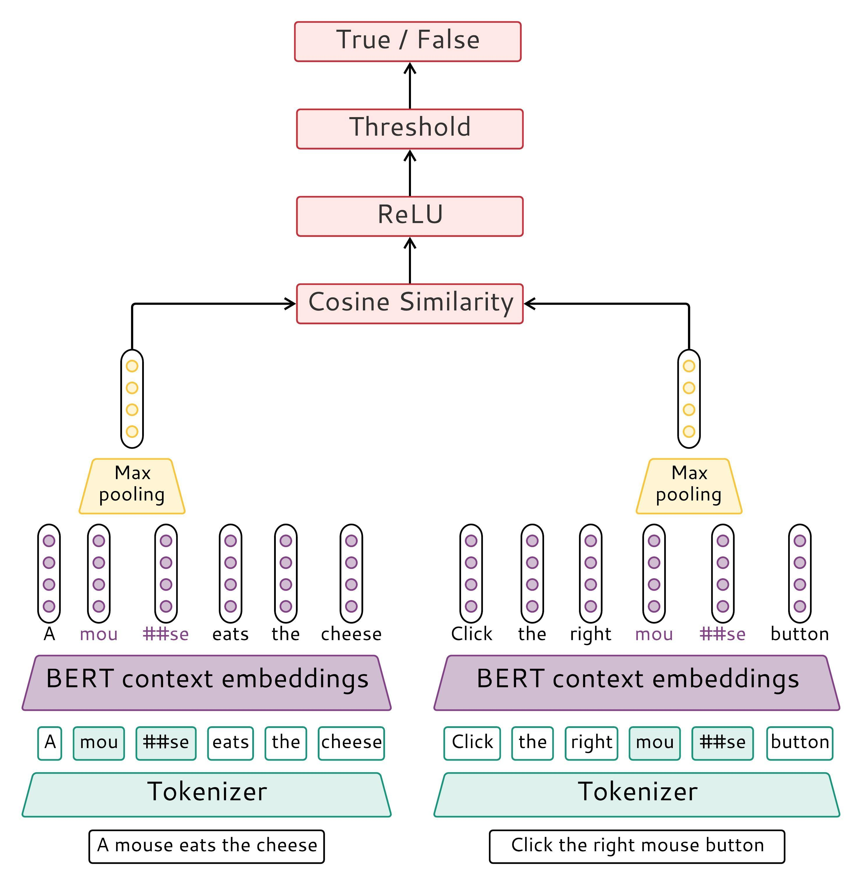

# Multilingual and Cross-lingual Word-in-Context Disambiguation

This repo contains our research on [Multilingual and Cross-lingual Word-in-Context Disambiguation](https://competitions.codalab.org/competitions/27054) (MCL-WiC) problem, which was conducted within Boris Zhestiankin bachelor degree thesis writing, together with our participation in SemEval-2021 Task 2.

There is a [paper](https://arxiv.org/abs/2104.06439), describing our approach. Its short summary is located below.

## Approach (EN-EN): 
1. We have enriched given train and development data for EN-EN sentences with WiC dataset for english.
2. We have mixed train and development data and split it randomly by unique lemmas in proportion 97.5% : 2.5%, having 14680 train samples and 386 development samples. The first part we used as a new train and the second as a new development dataset.
3. We have fine tuned bert-large-cased embeddings. AdamW optimiser from transformers was used with a learning rate equal to 1e-5. Each sentence was split by BertTokenizerFast into 118 tokens maximum. It is guaranteed that the longest sentence in the corpus won’t be truncated. Model was training for 4.5 epochs and stopped by EarlyStopping with patience equal to 2.
4. For a single sentence we have taken embeddings of all sub-tokens corresponding to the target word in it and then max pooled them into one embedding. It was done for both sentences in each pair and as a result we have obtained two embeddings: first — corresponding to target word in the first sentence and second — corresponding to target word in the second sentence.
5. Afterwards we have evaluated cosine similarity of these embeddings and activated this value through ReLU — this value is the model output, which was passed to Binary Cross Entropy Loss. 
6. After training we have built the ROC curve and have chosen the threshold as the value corresponding to maximum difference between true positive and false positive rates. After the last epoch the threshold was equal to 0.5195. We predict True if model output is greater than a predefined threshold and otherwise we predict False.

## Model diagram

## Authors
- **Boris Zhestiankin**, *Moscow Institute of Physics and Technology*, zhestyankin.ba@phystech.edu
- **Maria Ponomareva**, *ABBYY*, maria.ponomareva@abbyy.com
